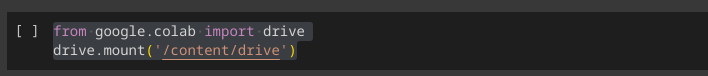

# Práctica 6: 

Elaboró: Carlos Alejandro Jarero Gonzalez <al255813@alumnos.uacj.mx>

Matrícula: 255813

El presente Notebook fue relizado en equipo local con Kernel Python 3.11.8 en VS Code.

## Instrucciones de uso

Este notebook puede extraer datos del Titanic en el archivo ```Titanic-Dataset.csv```, para analizar la información presente.

Si quieres cambiar el archivo, o la dirección del mismo, solo ve a la sección de parameters y cambia el ```input_path```.

### Si usas Google Colab

1. Ve a la sección de Files y asegurate de tener habilitado el acceso a tu Google Drive, de lo contrario hablitalo y dale los permisos correspondientes.
2. Si ya has realizado el paso anterior verás en tu notebook la siguiente instrucción de python para montar un volumen en el caso de linux ```/content/drive```, esto puede cambiar en diferentes sistemas operativos.

3. Asegurate de ejecutar la sección previa, dependidendo si ya has dado o no los permisos en este paso puede que de nuevo te solicite darle permiso. 
4. Ahora verás um directorio llamado drive donde encontarás tu Drive, ahí sube el archvio a procesar.
5. Copia el path absoluto de archivo de ```Titanic-Dataset.csv``` en ```input_path```.

## Objetivos

- Analizar datos del hundimiento del Titanic.

## Instrucciones: 

Carga el archivo titanic.csv en la carpeta correspondiente de Google drive para realizar los siguientes ejercicios

### Ejercicio 1: Análisis de la distribución de supervivencia por combinación de sexo y clase del pasajero.

- Calcula la proporción de supervivencia para cada combinación de 'Sex' y 'Pclass'.
- Identifica qué combinación tuvo la tasa de supervivencia más alta.
- Identifica qué combinación tuvo la tasa de supervivencia más baja.


### Ejercicio 2: Identificación de familias grandes a bordo.

- Crea una nueva columna ```FamilySize``` sumando las columnas ```SibSp``` y ```Parch```.
- Considera como ```familia grande``` a aquellas donde ```FamilySize``` es mayor a 3.
- Calcula el número de pasajeros en familias grandes.
- Calcula la proporción de supervivencia entre los pasajeros que pertenecen a familias grandes.

### Ejercicio 3: Segmentación por grupos de edad.

Clasifica a los pasajeros en las siguientes categorías de edad (tip puede resultar mas sencillo realizarlo con una función)

- Menor de Edad, cuando tenga menos de 18 años
- Mayor de Edad, cuando tenga 18 años o más

### Ejercicio 4: Comparación entre promedios calculados manualmente y con Pandas

- Utiliza NumPy para calcular el promedio de las columnas ```Age``` y ```Fare```, ignorando valores nulos.
- Compara estos valores con los promedios obtenidos utilizando los métodos nativos de Pandas.
- Verifica que los resultados sean consistentes.

### Ejercicio 5. Creación de intervalos de clase usando NumPy y análisis con Pandas

- Divide la columna ```Fare``` en 5 intervalos equidistantes utilizando la función numpy.linspace, el estudiante deberá investigar la operación de esta función en python.
- Crea una nueva columna en el DataFrame que asigne a cada pasajero el intervalo correspondiente de su tarifa.
- Calcula el número de pasajeros en cada intervalo utilizando Pandas y la proporción de supervivientes por intervalo.